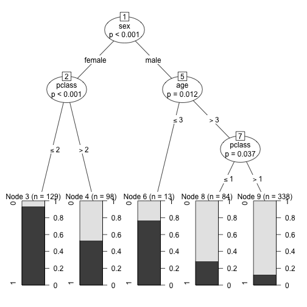

Legal Analytics Problem Set 3 - Part 1
-----------------------------------------------------------------------------
## Andy Ninh - 2014
-----------------------------------------------------------------------------

# Binary Classification – A Comparison of “Titanic” Proportions Between Logistic Regression, Random Forests, and Conditional Trees

The dataset I used contains records of the survival of Titanic Passengers and such information as sex, age, fare each person paid, number of parents/children aboard, number of siblings or spouses aboard, passenger class and other fields (The titanic dataset can be retrieved from a <a href="http://biostat.mc.vanderbilt.edu/twiki/bin/view/Main/DataSets">page on Vanderbilt’s website </a> replete with lots of datasets; look for “titanic3″).

I took one part of the dataset to train my models, and another part to test them.  The factors that I focused on were passenger class, sex, age, and number of siblings/spouses aboard.

## Creating the training data

```r
library(foreign)
titanic3 <- read.csv("http://biostat.mc.vanderbilt.edu/wiki/pub/Main/DataSets/titanic3.csv")
dim(titanic3)
```

```
## [1] 1309   14
```

```r
attributes(titanic3)
```

```
## $names
##  [1] "pclass"    "survived"  "name"      "sex"       "age"      
##  [6] "sibsp"     "parch"     "ticket"    "fare"      "cabin"    
## [11] "embarked"  "boat"      "body"      "home.dest"
## 
## $class
## [1] "data.frame"
## 
## $row.names
##    [1]    1    2    3    4    5    6    7    8    9   10   11   12   13
##   [14]   14   15   16   17   18   19   20   21   22   23   24   25   26
##   [27]   27   28   29   30   31   32   33   34   35   36   37   38   39
##   [40]   40   41   42   43   44   45   46   47   48   49   50   51   52
##   [53]   53   54   55   56   57   58   59   60   61   62   63   64   65
##   [66]   66   67   68   69   70   71   72   73   74   75   76   77   78
##   [79]   79   80   81   82   83   84   85   86   87   88   89   90   91
##   [92]   92   93   94   95   96   97   98   99  100  101  102  103  104
##  [105]  105  106  107  108  109  110  111  112  113  114  115  116  117
##  [118]  118  119  120  121  122  123  124  125  126  127  128  129  130
##  [131]  131  132  133  134  135  136  137  138  139  140  141  142  143
##  [144]  144  145  146  147  148  149  150  151  152  153  154  155  156
##  [157]  157  158  159  160  161  162  163  164  165  166  167  168  169
##  [170]  170  171  172  173  174  175  176  177  178  179  180  181  182
##  [183]  183  184  185  186  187  188  189  190  191  192  193  194  195
##  [196]  196  197  198  199  200  201  202  203  204  205  206  207  208
##  [209]  209  210  211  212  213  214  215  216  217  218  219  220  221
##  [222]  222  223  224  225  226  227  228  229  230  231  232  233  234
##  [235]  235  236  237  238  239  240  241  242  243  244  245  246  247
##  [248]  248  249  250  251  252  253  254  255  256  257  258  259  260
##  [261]  261  262  263  264  265  266  267  268  269  270  271  272  273
##  [274]  274  275  276  277  278  279  280  281  282  283  284  285  286
##  [287]  287  288  289  290  291  292  293  294  295  296  297  298  299
##  [300]  300  301  302  303  304  305  306  307  308  309  310  311  312
##  [313]  313  314  315  316  317  318  319  320  321  322  323  324  325
##  [326]  326  327  328  329  330  331  332  333  334  335  336  337  338
##  [339]  339  340  341  342  343  344  345  346  347  348  349  350  351
##  [352]  352  353  354  355  356  357  358  359  360  361  362  363  364
##  [365]  365  366  367  368  369  370  371  372  373  374  375  376  377
##  [378]  378  379  380  381  382  383  384  385  386  387  388  389  390
##  [391]  391  392  393  394  395  396  397  398  399  400  401  402  403
##  [404]  404  405  406  407  408  409  410  411  412  413  414  415  416
##  [417]  417  418  419  420  421  422  423  424  425  426  427  428  429
##  [430]  430  431  432  433  434  435  436  437  438  439  440  441  442
##  [443]  443  444  445  446  447  448  449  450  451  452  453  454  455
##  [456]  456  457  458  459  460  461  462  463  464  465  466  467  468
##  [469]  469  470  471  472  473  474  475  476  477  478  479  480  481
##  [482]  482  483  484  485  486  487  488  489  490  491  492  493  494
##  [495]  495  496  497  498  499  500  501  502  503  504  505  506  507
##  [508]  508  509  510  511  512  513  514  515  516  517  518  519  520
##  [521]  521  522  523  524  525  526  527  528  529  530  531  532  533
##  [534]  534  535  536  537  538  539  540  541  542  543  544  545  546
##  [547]  547  548  549  550  551  552  553  554  555  556  557  558  559
##  [560]  560  561  562  563  564  565  566  567  568  569  570  571  572
##  [573]  573  574  575  576  577  578  579  580  581  582  583  584  585
##  [586]  586  587  588  589  590  591  592  593  594  595  596  597  598
##  [599]  599  600  601  602  603  604  605  606  607  608  609  610  611
##  [612]  612  613  614  615  616  617  618  619  620  621  622  623  624
##  [625]  625  626  627  628  629  630  631  632  633  634  635  636  637
##  [638]  638  639  640  641  642  643  644  645  646  647  648  649  650
##  [651]  651  652  653  654  655  656  657  658  659  660  661  662  663
##  [664]  664  665  666  667  668  669  670  671  672  673  674  675  676
##  [677]  677  678  679  680  681  682  683  684  685  686  687  688  689
##  [690]  690  691  692  693  694  695  696  697  698  699  700  701  702
##  [703]  703  704  705  706  707  708  709  710  711  712  713  714  715
##  [716]  716  717  718  719  720  721  722  723  724  725  726  727  728
##  [729]  729  730  731  732  733  734  735  736  737  738  739  740  741
##  [742]  742  743  744  745  746  747  748  749  750  751  752  753  754
##  [755]  755  756  757  758  759  760  761  762  763  764  765  766  767
##  [768]  768  769  770  771  772  773  774  775  776  777  778  779  780
##  [781]  781  782  783  784  785  786  787  788  789  790  791  792  793
##  [794]  794  795  796  797  798  799  800  801  802  803  804  805  806
##  [807]  807  808  809  810  811  812  813  814  815  816  817  818  819
##  [820]  820  821  822  823  824  825  826  827  828  829  830  831  832
##  [833]  833  834  835  836  837  838  839  840  841  842  843  844  845
##  [846]  846  847  848  849  850  851  852  853  854  855  856  857  858
##  [859]  859  860  861  862  863  864  865  866  867  868  869  870  871
##  [872]  872  873  874  875  876  877  878  879  880  881  882  883  884
##  [885]  885  886  887  888  889  890  891  892  893  894  895  896  897
##  [898]  898  899  900  901  902  903  904  905  906  907  908  909  910
##  [911]  911  912  913  914  915  916  917  918  919  920  921  922  923
##  [924]  924  925  926  927  928  929  930  931  932  933  934  935  936
##  [937]  937  938  939  940  941  942  943  944  945  946  947  948  949
##  [950]  950  951  952  953  954  955  956  957  958  959  960  961  962
##  [963]  963  964  965  966  967  968  969  970  971  972  973  974  975
##  [976]  976  977  978  979  980  981  982  983  984  985  986  987  988
##  [989]  989  990  991  992  993  994  995  996  997  998  999 1000 1001
## [1002] 1002 1003 1004 1005 1006 1007 1008 1009 1010 1011 1012 1013 1014
## [1015] 1015 1016 1017 1018 1019 1020 1021 1022 1023 1024 1025 1026 1027
## [1028] 1028 1029 1030 1031 1032 1033 1034 1035 1036 1037 1038 1039 1040
## [1041] 1041 1042 1043 1044 1045 1046 1047 1048 1049 1050 1051 1052 1053
## [1054] 1054 1055 1056 1057 1058 1059 1060 1061 1062 1063 1064 1065 1066
## [1067] 1067 1068 1069 1070 1071 1072 1073 1074 1075 1076 1077 1078 1079
## [1080] 1080 1081 1082 1083 1084 1085 1086 1087 1088 1089 1090 1091 1092
## [1093] 1093 1094 1095 1096 1097 1098 1099 1100 1101 1102 1103 1104 1105
## [1106] 1106 1107 1108 1109 1110 1111 1112 1113 1114 1115 1116 1117 1118
## [1119] 1119 1120 1121 1122 1123 1124 1125 1126 1127 1128 1129 1130 1131
## [1132] 1132 1133 1134 1135 1136 1137 1138 1139 1140 1141 1142 1143 1144
## [1145] 1145 1146 1147 1148 1149 1150 1151 1152 1153 1154 1155 1156 1157
## [1158] 1158 1159 1160 1161 1162 1163 1164 1165 1166 1167 1168 1169 1170
## [1171] 1171 1172 1173 1174 1175 1176 1177 1178 1179 1180 1181 1182 1183
## [1184] 1184 1185 1186 1187 1188 1189 1190 1191 1192 1193 1194 1195 1196
## [1197] 1197 1198 1199 1200 1201 1202 1203 1204 1205 1206 1207 1208 1209
## [1210] 1210 1211 1212 1213 1214 1215 1216 1217 1218 1219 1220 1221 1222
## [1223] 1223 1224 1225 1226 1227 1228 1229 1230 1231 1232 1233 1234 1235
## [1236] 1236 1237 1238 1239 1240 1241 1242 1243 1244 1245 1246 1247 1248
## [1249] 1249 1250 1251 1252 1253 1254 1255 1256 1257 1258 1259 1260 1261
## [1262] 1262 1263 1264 1265 1266 1267 1268 1269 1270 1271 1272 1273 1274
## [1275] 1275 1276 1277 1278 1279 1280 1281 1282 1283 1284 1285 1286 1287
## [1288] 1288 1289 1290 1291 1292 1293 1294 1295 1296 1297 1298 1299 1300
## [1301] 1301 1302 1303 1304 1305 1306 1307 1308 1309
```

```r
titanic3[1:5, ]
```

```
##   pclass survived                                            name    sex
## 1      1        1                   Allen, Miss. Elisabeth Walton female
## 2      1        1                  Allison, Master. Hudson Trevor   male
## 3      1        0                    Allison, Miss. Helen Loraine female
## 4      1        0            Allison, Mr. Hudson Joshua Creighton   male
## 5      1        0 Allison, Mrs. Hudson J C (Bessie Waldo Daniels) female
##     age sibsp parch ticket  fare   cabin embarked boat body
## 1 29.00     0     0  24160 211.3      B5        S    2   NA
## 2  0.92     1     2 113781 151.6 C22 C26        S   11   NA
## 3  2.00     1     2 113781 151.6 C22 C26        S        NA
## 4 30.00     1     2 113781 151.6 C22 C26        S       135
## 5 25.00     1     2 113781 151.6 C22 C26        S        NA
##                         home.dest
## 1                    St Louis, MO
## 2 Montreal, PQ / Chesterville, ON
## 3 Montreal, PQ / Chesterville, ON
## 4 Montreal, PQ / Chesterville, ON
## 5 Montreal, PQ / Chesterville, ON
```

```r
set.seed(1234)
ind <- sample(2, nrow(titanic3), replace = TRUE, prob = c(0.5, 0.5))
titanic.train <- titanic3[ind == 1, ]
titanic.test <- titanic3[ind == 2, ]
```


## GLM

```r
titanic.survival.train = glm(survived ~ pclass + sex + pclass:sex + age + sibsp, 
    family = binomial(logit), data = titanic.train)
```


As you can see, I worked in an interaction effect between passenger class and sex, as passenger class showed a much bigger difference in survival rate amongst the women compared to the men (i.e. Higher class women were much more likely to survive than lower class women, whereas first class Men were more likely to survive than 2nd or 3rd class men, but not by the same margin as amongst the women).  Following is the model summary output, if you’re interested:

```r
summary(titanic.survival.train)
```

```
## 
## Call:
## glm(formula = survived ~ pclass + sex + pclass:sex + age + sibsp, 
##     family = binomial(logit), data = titanic.train)
## 
## Deviance Residuals: 
##    Min      1Q  Median      3Q     Max  
## -3.125  -0.609  -0.451   0.413   2.394  
## 
## Coefficients:
##                Estimate Std. Error z value Pr(>|z|)    
## (Intercept)      7.1641     1.0035    7.14  9.4e-13 ***
## pclass          -1.9611     0.3281   -5.98  2.3e-09 ***
## sexmale         -5.7480     0.9390   -6.12  9.3e-10 ***
## age             -0.0411     0.0102   -4.04  5.5e-05 ***
## sibsp           -0.2467     0.1466   -1.68  0.09236 .  
## pclass:sexmale   1.1966     0.3626    3.30  0.00097 ***
## ---
## Signif. codes:  0 '***' 0.001 '**' 0.01 '*' 0.05 '.' 0.1 ' ' 1
## 
## (Dispersion parameter for binomial family taken to be 1)
## 
##     Null deviance: 721.33  on 536  degrees of freedom
## Residual deviance: 451.77  on 531  degrees of freedom
##   (125 observations deleted due to missingness)
## AIC: 463.8
## 
## Number of Fisher Scoring iterations: 5
```


So, after I used my model to predict survival probabilities on the testing portion of the dataset, I checked to see how many records showed a probability of over .5 (or 50%), and then how many of those records were actual survivors.  For the GLM, 146/164 (89%) of those records scored at 50% or higher were actual survivors.  Not bad!

## Random Forests

```r
library(randomForest)
```

```
## randomForest 4.6-7
## Type rfNews() to see new features/changes/bug fixes.
```

```r
titanic.survival.train.rf = randomForest(as.factor(survived) ~ pclass + sex + 
    age + sibsp, data = titanic.train, ntree = 5000, importance = TRUE, na.action = na.omit)
titanic.survival.train.rf
```

```
## 
## Call:
##  randomForest(formula = as.factor(survived) ~ pclass + sex + age +      sibsp, data = titanic.train, ntree = 5000, importance = TRUE,      na.action = na.omit) 
##                Type of random forest: classification
##                      Number of trees: 5000
## No. of variables tried at each split: 2
## 
##         OOB estimate of  error rate: 17.32%
## Confusion matrix:
##     0   1 class.error
## 0 290  34      0.1049
## 1  59 154      0.2770
```

```r
importance(titanic.survival.train.rf)
```

```
##             0       1 MeanDecreaseAccuracy MeanDecreaseGini
## pclass  52.69  83.475                93.21            23.68
## sex    261.39 302.222               328.78            86.82
## age     85.65  73.552               111.39            44.60
## sibsp   71.67  -3.948                59.32            11.66
```

It seems to me that the output indicates that the Random Forests model is better at creating true negatives than true positives, with regards to survival of the passengers, but when I asked for the predicted survival categories in the testing portion of my dataset, it appeared to do a pretty decent job predicting who would survive and who wouldn’t:

For the Random Forests model, 155/184 (84%) of those records predicted to survive actually did survive!  Again, not bad.

## The Conditional Tree Model

```r
library(party)
```

```
## Loading required package: grid
## Loading required package: zoo
## 
## Attaching package: 'zoo'
## 
## The following objects are masked from 'package:base':
## 
##     as.Date, as.Date.numeric
## 
## Loading required package: sandwich
## Loading required package: strucchange
## Loading required package: modeltools
## Loading required package: stats4
```

```r
titanic.survival.train.ctree = ctree(as.factor(survived) ~ pclass + sex + age + 
    sibsp, data = titanic.train)
titanic.survival.train.ctree
```

```
## 
## 	 Conditional inference tree with 5 terminal nodes
## 
## Response:  as.factor(survived) 
## Inputs:  pclass, sex, age, sibsp 
## Number of observations:  662 
## 
## 1) sex == {female}; criterion = 1, statistic = 216.071
##   2) pclass <= 2; criterion = 1, statistic = 46.661
##     3)*  weights = 129 
##   2) pclass > 2
##     4)*  weights = 98 
## 1) sex == {male}
##   5) age <= 3; criterion = 0.988, statistic = 8.813
##     6)*  weights = 13 
##   5) age > 3
##     7) pclass <= 1; criterion = 0.963, statistic = 6.732
##       8)*  weights = 84 
##     7) pclass > 1
##       9)*  weights = 338
```

```r
plot(titanic.survival.train.ctree)
```

 


This is the end.
