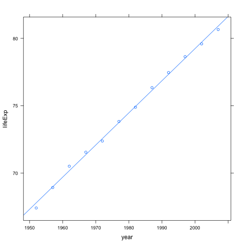

Legal Analytics Problem Set 3 - Part 2
-----------------------------------------------------------------------------
## Andy Ninh - 2014
-----------------------------------------------------------------------------

## Loading the Gapminder data

```r
gdURL <- "http://www.stat.ubc.ca/~jenny/notOcto/STAT545A/examples/gapminder/data/gapminderDataFiveYear.txt"
gDat <- read.delim(file = gdURL)
```


```r
str(gDat)
```

```
## 'data.frame':	1704 obs. of  6 variables:
##  $ country  : Factor w/ 142 levels "Afghanistan",..: 1 1 1 1 1 1 1 1 1 1 ...
##  $ year     : int  1952 1957 1962 1967 1972 1977 1982 1987 1992 1997 ...
##  $ pop      : num  8425333 9240934 10267083 11537966 13079460 ...
##  $ continent: Factor w/ 5 levels "Africa","Americas",..: 3 3 3 3 3 3 3 3 3 3 ...
##  $ lifeExp  : num  28.8 30.3 32 34 36.1 ...
##  $ gdpPercap: num  779 821 853 836 740 ...
```


## Storing a snippet of the data

```r
(snippet <- subset(gDat, country == "Canada"))
```

```
##     country year      pop continent lifeExp gdpPercap
## 241  Canada 1952 14785584  Americas   68.75     11367
## 242  Canada 1957 17010154  Americas   69.96     12490
## 243  Canada 1962 18985849  Americas   71.30     13462
## 244  Canada 1967 20819767  Americas   72.13     16077
## 245  Canada 1972 22284500  Americas   72.88     18971
## 246  Canada 1977 23796400  Americas   74.21     22091
## 247  Canada 1982 25201900  Americas   75.76     22899
## 248  Canada 1987 26549700  Americas   76.86     26627
## 249  Canada 1992 28523502  Americas   77.95     26343
## 250  Canada 1997 30305843  Americas   78.61     28955
## 251  Canada 2002 31902268  Americas   79.77     33329
## 252  Canada 2007 33390141  Americas   80.65     36319
```


## Installing and Loading plyr

```r
install.packages("plyr", dependencies = TRUE)
```

```
## Error: trying to use CRAN without setting a mirror
```

```r
library(plyr)
```


## Using ddply to find the maximum life expentency of each continent

```r
(maxLeByCont <- ddply(gDat, ~continent, summarize, maxLifeExp = max(lifeExp)))
```

```
##   continent maxLifeExp
## 1    Africa      76.44
## 2  Americas      80.65
## 3      Asia      82.60
## 4    Europe      81.76
## 5   Oceania      81.23
```


## Studying the return value

```r
str(maxLeByCont)
```

```
## 'data.frame':	5 obs. of  2 variables:
##  $ continent : Factor w/ 5 levels "Africa","Americas",..: 1 2 3 4 5
##  $ maxLifeExp: num  76.4 80.7 82.6 81.8 81.2
```

```r
levels(maxLeByCont$continent)
```

```
## [1] "Africa"   "Americas" "Asia"     "Europe"   "Oceania"
```


## Computing the minimum GDP per capita by continent

```r
(mingdpPercap <- ddply(gDat, ~continent, summarize, minGDPperCap = min(gdpPercap)))
```

```
##   continent minGDPperCap
## 1    Africa        241.2
## 2  Americas       1201.6
## 3      Asia        331.0
## 4    Europe        973.5
## 5   Oceania      10039.6
```


## Counting the number of countries in the data set

```r
ddply(gDat, ~continent, summarize, nUniqCountries = length(unique(country)))
```

```
##   continent nUniqCountries
## 1    Africa             52
## 2  Americas             25
## 3      Asia             33
## 4    Europe             30
## 5   Oceania              2
```


## Alternate method without using summarize()

```r
ddply(gDat, ~continent, function(x) return(c(nUniqCountries = length(unique(x$country)))))
```

```
##   continent nUniqCountries
## 1    Africa             52
## 2  Americas             25
## 3      Asia             33
## 4    Europe             30
## 5   Oceania              2
```


## You can compute multiple things per sub-data.frame

```r
ddply(gDat, ~continent, summarize, minLifeExp = min(lifeExp), maxLifeExp = max(lifeExp), 
    medGdpPercap = median(gdpPercap))
```

```
##   continent minLifeExp maxLifeExp medGdpPercap
## 1    Africa      23.60      76.44         1192
## 2  Americas      37.58      80.65         5466
## 3      Asia      28.80      82.60         2647
## 4    Europe      43.59      81.76        12082
## 5   Oceania      69.12      81.23        17983
```


# Putting it all together using ddply()

```r
jCountry <- "France"  # pick, but do not hard wire, an example
(jDat <- subset(gDat, country == jCountry))  # temporary measure!
```

```
##     country year      pop continent lifeExp gdpPercap
## 529  France 1952 42459667    Europe   67.41      7030
## 530  France 1957 44310863    Europe   68.93      8663
## 531  France 1962 47124000    Europe   70.51     10560
## 532  France 1967 49569000    Europe   71.55     13000
## 533  France 1972 51732000    Europe   72.38     16107
## 534  France 1977 53165019    Europe   73.83     18293
## 535  France 1982 54433565    Europe   74.89     20294
## 536  France 1987 55630100    Europe   76.34     22066
## 537  France 1992 57374179    Europe   77.46     24704
## 538  France 1997 58623428    Europe   78.64     25890
## 539  France 2002 59925035    Europe   79.59     28926
## 540  France 2007 61083916    Europe   80.66     30470
```


## Installing and loading lattice for plotting graphics

```r
install.packages("lattice")
```

```
## Error: trying to use CRAN without setting a mirror
```

```r
library(lattice)
```


## Plotting the data 

```r
xyplot(lifeExp ~ year, jDat, type = c("p", "r"))  # always plot the data
```

 

```r
jFit <- lm(lifeExp ~ year, jDat)
summary(jFit)
```

```
## 
## Call:
## lm(formula = lifeExp ~ year, data = jDat)
## 
## Residuals:
##     Min      1Q  Median      3Q     Max 
## -0.3801 -0.1389  0.0124  0.1429  0.3349 
## 
## Coefficients:
##              Estimate Std. Error t value Pr(>|t|)    
## (Intercept) -3.98e+02   7.29e+00   -54.6  1.0e-13 ***
## year         2.38e-01   3.68e-03    64.8  1.9e-14 ***
## ---
## Signif. codes:  0 '***' 0.001 '**' 0.01 '*' 0.05 '.' 0.1 ' ' 1
## 
## Residual standard error: 0.22 on 10 degrees of freedom
## Multiple R-squared:  0.998,	Adjusted R-squared:  0.997 
## F-statistic: 4.2e+03 on 1 and 10 DF,  p-value: 1.86e-14
```


## Adjusting for fit


```r
(yearMin <- min(gDat$year))
```

```
## [1] 1952
```

```r
jFit <- lm(lifeExp ~ I(year - yearMin), jDat)
summary(jFit)
```

```
## 
## Call:
## lm(formula = lifeExp ~ I(year - yearMin), data = jDat)
## 
## Residuals:
##     Min      1Q  Median      3Q     Max 
## -0.3801 -0.1389  0.0124  0.1429  0.3349 
## 
## Coefficients:
##                   Estimate Std. Error t value Pr(>|t|)    
## (Intercept)       67.79013    0.11949   567.3  < 2e-16 ***
## I(year - yearMin)  0.23850    0.00368    64.8  1.9e-14 ***
## ---
## Signif. codes:  0 '***' 0.001 '**' 0.01 '*' 0.05 '.' 0.1 ' ' 1
## 
## Residual standard error: 0.22 on 10 degrees of freedom
## Multiple R-squared:  0.998,	Adjusted R-squared:  0.997 
## F-statistic: 4.2e+03 on 1 and 10 DF,  p-value: 1.86e-14
```

The intercept is around 68. This makes much more sense. So, what is jFit and what can we get out of it?

```r
class(jFit)
```

```
## [1] "lm"
```

```r
mode(jFit)
```

```
## [1] "list"
```

So, jFit is of class "lm" and its mode is list. So that means I could use indexing to isolate specific components. But what's in there?


```r
## str(jFit) # too ugly to print here but you should look
names(jFit)
```

```
##  [1] "coefficients"  "residuals"     "effects"       "rank"         
##  [5] "fitted.values" "assign"        "qr"            "df.residual"  
##  [9] "xlevels"       "call"          "terms"         "model"
```

```r
jFit$coefficients
```

```
##       (Intercept) I(year - yearMin) 
##           67.7901            0.2385
```

Using str() and names() reveals a great deal about this "lm" object and reading the help file for lm() would explain a great deal more. In the See Also section we learn there's a generic function coef() which looks promising.

```r
coef(jFit)
```

```
##       (Intercept) I(year - yearMin) 
##           67.7901            0.2385
```

We have achieved our goal for this specific country -- we've gotten its intercept and slope. Now we need to package that as a function.

```r
jFun <- function(x) coef(lm(lifeExp ~ I(year - yearMin), x))
jFun(jDat)  # trying out our new function ... yes still get same numbers
```

```
##       (Intercept) I(year - yearMin) 
##           67.7901            0.2385
```


## Changing the names of the return values

```r
jFun <- function(x) {
    estCoefs <- coef(lm(lifeExp ~ I(year - yearMin), x))
    names(estCoefs) <- c("intercept", "slope")
    return(estCoefs)
}
jFun(jDat)  # trying out our improved function ... yes still get same numbers
```

```
## intercept     slope 
##   67.7901    0.2385
```


## Testing the new function on some examples

```r
jFun(subset(gDat, country == "Canada"))
```

```
## intercept     slope 
##   68.8838    0.2189
```

```r
jFun(subset(gDat, country == "Uruguay"))
```

```
## intercept     slope 
##   65.7416    0.1833
```

```r
jFun(subset(gDat, country == "India"))
```

```
## intercept     slope 
##   39.2698    0.5053
```

```r
jFun(subset(gDat, country == "Japan"))
```

```
## intercept     slope 
##   65.1221    0.3529
```

```r
jFun(subset(gDat, country == "Iceland"))
```

```
## intercept     slope 
##   71.9636    0.1654
```


## Scaling up -- Placing the function inside ddply()

```r
jCoefs <- ddply(gDat, ~country, jFun)
str(jCoefs)
```

```
## 'data.frame':	142 obs. of  3 variables:
##  $ country  : Factor w/ 142 levels "Afghanistan",..: 1 2 3 4 5 6 7 8 9 10 ...
##  $ intercept: num  29.9 59.2 43.4 32.1 62.7 ...
##  $ slope    : num  0.275 0.335 0.569 0.209 0.232 ...
```

```r
tail(jCoefs)
```

```
##                country intercept    slope
## 137          Venezuela     57.51  0.32972
## 138            Vietnam     39.01  0.67162
## 139 West Bank and Gaza     43.80  0.60110
## 140        Yemen, Rep.     30.13  0.60546
## 141             Zambia     47.66 -0.06043
## 142           Zimbabwe     55.22 -0.09302
```


# Review: This would be the final script

```r
## realistically, you would read the data from a local file
gdURL <- "http://www.stat.ubc.ca/~jenny/notOcto/STAT545A/examples/gapminder/data/gapminderDataFiveYear.txt"
gDat <- read.delim(file = gdURL)
## str(gDat) here when working interactively
yearMin <- min(gDat$year)
jFun <- function(x) {
    estCoefs <- coef(lm(lifeExp ~ I(year - yearMin), x))
    names(estCoefs) <- c("intercept", "slope")
    return(estCoefs)
}
## jFun(subset(gDat, country == 'India')) to see what it does
jCoefs <- ddply(gDat, ~country, jFun)
```

## Installing and loading xtable 

```r
install.packages("xtable", dependencies = TRUE)
```

```
## Error: trying to use CRAN without setting a mirror
```

```r
library(xtable)
```


## Pick some countries at random and display their estimated coefficients

```r
set.seed(916)
foo <- jCoefs[sample(nrow(jCoefs), size = 15), ]
foo <- xtable(foo)
print(foo, type = "html", include.rownames = FALSE)
```

<!-- html table generated in R 3.0.2 by xtable 1.7-3 package -->
<!-- Mon Apr  7 00:42:34 2014 -->
<TABLE border=1>
<TR> <TH> country </TH> <TH> intercept </TH> <TH> slope </TH>  </TR>
  <TR> <TD> Lebanon </TD> <TD align="right"> 58.69 </TD> <TD align="right"> 0.26 </TD> </TR>
  <TR> <TD> Senegal </TD> <TD align="right"> 36.75 </TD> <TD align="right"> 0.50 </TD> </TR>
  <TR> <TD> Dominican Republic </TD> <TD align="right"> 48.60 </TD> <TD align="right"> 0.47 </TD> </TR>
  <TR> <TD> Oman </TD> <TD align="right"> 37.21 </TD> <TD align="right"> 0.77 </TD> </TR>
  <TR> <TD> Germany </TD> <TD align="right"> 67.57 </TD> <TD align="right"> 0.21 </TD> </TR>
  <TR> <TD> Korea, Dem. Rep. </TD> <TD align="right"> 54.91 </TD> <TD align="right"> 0.32 </TD> </TR>
  <TR> <TD> Mauritius </TD> <TD align="right"> 55.37 </TD> <TD align="right"> 0.35 </TD> </TR>
  <TR> <TD> Slovak Republic </TD> <TD align="right"> 67.01 </TD> <TD align="right"> 0.13 </TD> </TR>
  <TR> <TD> Comoros </TD> <TD align="right"> 40.00 </TD> <TD align="right"> 0.45 </TD> </TR>
  <TR> <TD> Argentina </TD> <TD align="right"> 62.69 </TD> <TD align="right"> 0.23 </TD> </TR>
  <TR> <TD> Central African Republic </TD> <TD align="right"> 38.81 </TD> <TD align="right"> 0.18 </TD> </TR>
  <TR> <TD> Ecuador </TD> <TD align="right"> 49.07 </TD> <TD align="right"> 0.50 </TD> </TR>
  <TR> <TD> West Bank and Gaza </TD> <TD align="right"> 43.80 </TD> <TD align="right"> 0.60 </TD> </TR>
  <TR> <TD> Egypt </TD> <TD align="right"> 40.97 </TD> <TD align="right"> 0.56 </TD> </TR>
  <TR> <TD> Myanmar </TD> <TD align="right"> 41.41 </TD> <TD align="right"> 0.43 </TD> </TR>
   </TABLE>

## Two easy improvements: include the continent information and sort rationally

```r
jCoefs <- ddply(gDat, ~country + continent, jFun)
str(jCoefs)
```

```
## 'data.frame':	142 obs. of  4 variables:
##  $ country  : Factor w/ 142 levels "Afghanistan",..: 1 2 3 4 5 6 7 8 9 10 ...
##  $ continent: Factor w/ 5 levels "Africa","Americas",..: 3 4 1 1 2 5 4 3 3 4 ...
##  $ intercept: num  29.9 59.2 43.4 32.1 62.7 ...
##  $ slope    : num  0.275 0.335 0.569 0.209 0.232 ...
```

```r
tail(jCoefs)
```

```
##                country continent intercept    slope
## 137          Venezuela  Americas     57.51  0.32972
## 138            Vietnam      Asia     39.01  0.67162
## 139 West Bank and Gaza      Asia     43.80  0.60110
## 140        Yemen, Rep.      Asia     30.13  0.60546
## 141             Zambia    Africa     47.66 -0.06043
## 142           Zimbabwe    Africa     55.22 -0.09302
```

Now, prior to making the HTML table, we will sort the data.frame, so it starts with the country with the shortest life expectancy in 1952, and goes to the largest.

```r
set.seed(916)
foo <- jCoefs[sample(nrow(jCoefs), size = 15), ]
foo <- arrange(foo, intercept)
## foo <- foo[order(foo$intercept), ] # an uglier non-plyr way
foo <- xtable(foo)
print(foo, type = "html", include.rownames = FALSE)
```

<!-- html table generated in R 3.0.2 by xtable 1.7-3 package -->
<!-- Mon Apr  7 00:42:35 2014 -->
<TABLE border=1>
<TR> <TH> country </TH> <TH> continent </TH> <TH> intercept </TH> <TH> slope </TH>  </TR>
  <TR> <TD> Senegal </TD> <TD> Africa </TD> <TD align="right"> 36.75 </TD> <TD align="right"> 0.50 </TD> </TR>
  <TR> <TD> Oman </TD> <TD> Asia </TD> <TD align="right"> 37.21 </TD> <TD align="right"> 0.77 </TD> </TR>
  <TR> <TD> Central African Republic </TD> <TD> Africa </TD> <TD align="right"> 38.81 </TD> <TD align="right"> 0.18 </TD> </TR>
  <TR> <TD> Comoros </TD> <TD> Africa </TD> <TD align="right"> 40.00 </TD> <TD align="right"> 0.45 </TD> </TR>
  <TR> <TD> Egypt </TD> <TD> Africa </TD> <TD align="right"> 40.97 </TD> <TD align="right"> 0.56 </TD> </TR>
  <TR> <TD> Myanmar </TD> <TD> Asia </TD> <TD align="right"> 41.41 </TD> <TD align="right"> 0.43 </TD> </TR>
  <TR> <TD> West Bank and Gaza </TD> <TD> Asia </TD> <TD align="right"> 43.80 </TD> <TD align="right"> 0.60 </TD> </TR>
  <TR> <TD> Dominican Republic </TD> <TD> Americas </TD> <TD align="right"> 48.60 </TD> <TD align="right"> 0.47 </TD> </TR>
  <TR> <TD> Ecuador </TD> <TD> Americas </TD> <TD align="right"> 49.07 </TD> <TD align="right"> 0.50 </TD> </TR>
  <TR> <TD> Korea, Dem. Rep. </TD> <TD> Asia </TD> <TD align="right"> 54.91 </TD> <TD align="right"> 0.32 </TD> </TR>
  <TR> <TD> Mauritius </TD> <TD> Africa </TD> <TD align="right"> 55.37 </TD> <TD align="right"> 0.35 </TD> </TR>
  <TR> <TD> Lebanon </TD> <TD> Asia </TD> <TD align="right"> 58.69 </TD> <TD align="right"> 0.26 </TD> </TR>
  <TR> <TD> Argentina </TD> <TD> Americas </TD> <TD align="right"> 62.69 </TD> <TD align="right"> 0.23 </TD> </TR>
  <TR> <TD> Slovak Republic </TD> <TD> Europe </TD> <TD align="right"> 67.01 </TD> <TD align="right"> 0.13 </TD> </TR>
  <TR> <TD> Germany </TD> <TD> Europe </TD> <TD align="right"> 67.57 </TD> <TD align="right"> 0.21 </TD> </TR>
   </TABLE>


# jFun only requires one argument, x. What if it had more than one argument?

```r
jFunTwoArgs <- function(x, cvShift = 0) {
    estCoefs <- coef(lm(lifeExp ~ I(year - cvShift), x))
    names(estCoefs) <- c("intercept", "slope")
    return(estCoefs)
}
jCoefsSilly <- ddply(gDat, ~country, jFunTwoArgs)
head(jCoefsSilly)
```

```
##       country intercept  slope
## 1 Afghanistan    -507.5 0.2753
## 2     Albania    -594.1 0.3347
## 3     Algeria   -1067.9 0.5693
## 4      Angola    -376.5 0.2093
## 5   Argentina    -389.6 0.2317
## 6   Australia    -376.1 0.2277
```

We are getting the same estimated slopes but the silly year 0 intercepts we've seen before. Let's use the cvShift = argument to resolve this.

```r
jCoefsSane <- ddply(gDat, ~country, jFunTwoArgs, cvShift = 1952)
head(jCoefsSane)
```

```
##       country intercept  slope
## 1 Afghanistan     29.91 0.2753
## 2     Albania     59.23 0.3347
## 3     Algeria     43.37 0.5693
## 4      Angola     32.13 0.2093
## 5   Argentina     62.69 0.2317
## 6   Australia     68.40 0.2277
```

We're back to our usual estimated intercepts, which reflect life expectancy in 1952. Of course hard-wiring 1952 is not a great idea, so here's probably our best code yet:

```r
jCoefsBest <- ddply(gDat, ~country, jFunTwoArgs, cvShift = min(gDat$year))
head(jCoefsBest)
```

```
##       country intercept  slope
## 1 Afghanistan     29.91 0.2753
## 2     Albania     59.23 0.3347
## 3     Algeria     43.37 0.5693
## 4      Angola     32.13 0.2093
## 5   Argentina     62.69 0.2317
## 6   Australia     68.40 0.2277
```

