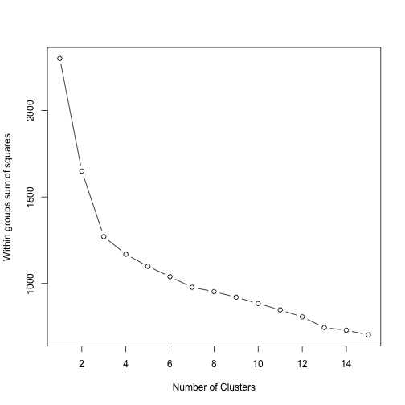
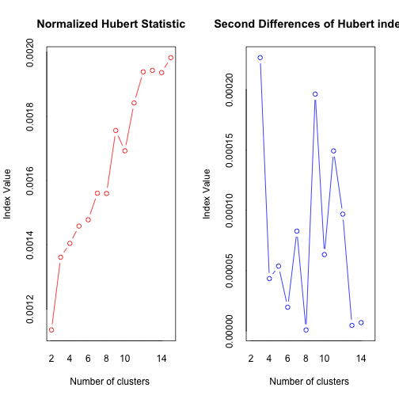
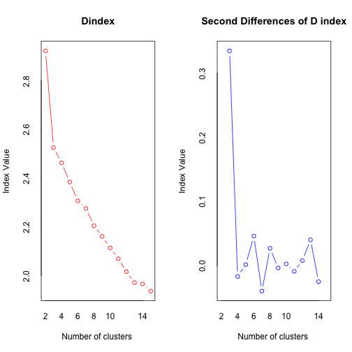
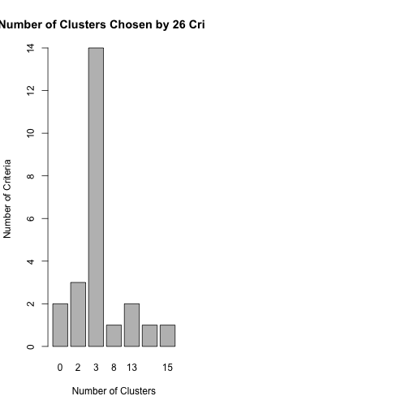

Legal Analytics Problem Set 3 Part 3(b)
========================================================
## Andy Ninh 2014
========================================================
**Task**: Replicate the K-Means Clustering exercise found <a href="http://www.r-statistics.com/2013/08/k-means-clustering-from-r-in-action/">here</a>.

# K-MEANS CLUSTERING (FROM “R IN ACTION”)

In R’s partitioning approach, observations are divided into K groups and reshuffled to form the most cohesive clusters possible according to a given criterion. There are two methods—K-means and partitioning around mediods (PAM).

## K-means clustering

The most common partitioning method is the K-means cluster analysis. Conceptually, the K-means algorithm:

<ol>
<li>Selects K centroids (K rows chosen at random</li>
<li>Assigns each data point to its closest centroid</li>
<li>Recalculates the centroids as the average of all data points in a cluster (i.e., the centroids are p-length mean vectors, where p is the number of variables)</li>
<li>Assigns data points to their closest centroids</li>
<li>Continues steps 3 and 4 until the observations are not reassigned or the maximum number of iterations (R uses 10 as a default) is reached.</li>
</ol>

Implementation details for this approach can vary.

R uses an efficient algorithm by Hartigan and Wong (1979) that partitions the observations into k groups such that the sum of squares of the observations to their assigned cluster centers is a minimum. This means that in steps 2 and 4, each observation is assigned to the cluster with the smallest value of:

<p align="center"></p>

Where k is the cluster,xij is the value of the jth variable for the ith observation, and xkj-bar is the mean of the jth variable for the kth cluster.

K-means clustering can handle larger datasets than hierarchical cluster approaches. Additionally, observations are not permanently committed to a cluster. They are moved when doing so improves the overall solution. However, the use of means implies that all variables must be continuous and the approach can be severely affected by outliers. They also perform poorly in the presence of non-convex (e.g., U-shaped) clusters.

The format of the K-means function in R is kmeans(x, centers) where x is a numeric dataset (matrix or data frame) and centers is the number of clusters to extract. The function returns the cluster memberships, centroids, sums of squares (within, between, total), and cluster sizes.

Since K-means cluster analysis starts with k randomly chosen centroids, a different solution can be obtained each time the function is invoked. Use the set.seed() function to guarantee that the results are reproducible. Additionally, this clustering approach can be sensitive to the initial selection of centroids. The kmeans() function has an nstart option that attempts multiple initial configurations and reports on the best one. For example, adding nstart=25 will generate 25 initial configurations. This approach is often recommended.

Unlike hierarchical clustering, K-means clustering requires that the number of clusters to extract be specified in advance. Again, the NbClust package can be used as a guide. Additionally, a plot of the total within-groups sums of squares against the number of clusters in a K-means solution can be helpful. A bend in the graph can suggest the appropriate number of clusters. The graph can be produced by the following function.


```r
wssplot <- function(data, nc = 15, seed = 1234) {
    wss <- (nrow(data) - 1) * sum(apply(data, 2, var))
    for (i in 2:nc) {
        set.seed(seed)
        wss[i] <- sum(kmeans(data, centers = i)$withinss)
    }
    plot(1:nc, wss, type = "b", xlab = "Number of Clusters", ylab = "Within groups sum of squares")
}
```


The data parameter is the numeric dataset to be analyzed, nc is the maximum number of clusters to consider, and seed is a random number seed.

Here, a dataset containing 13 chemical measurements on 178 Italian wine samples is analyzed. The data originally come from the UCI Machine Learning Repository (http://www.ics.uci.edu/~mlearn/MLRepository.html) but we will access it via the rattle package. A K-means cluster analysis of the data is provided in listing 1.


```r
data(wine, package = "rattle")
head(wine)
```

```
##   Type Alcohol Malic  Ash Alcalinity Magnesium Phenols Flavanoids
## 1    1   14.23  1.71 2.43       15.6       127    2.80       3.06
## 2    1   13.20  1.78 2.14       11.2       100    2.65       2.76
## 3    1   13.16  2.36 2.67       18.6       101    2.80       3.24
## 4    1   14.37  1.95 2.50       16.8       113    3.85       3.49
## 5    1   13.24  2.59 2.87       21.0       118    2.80       2.69
## 6    1   14.20  1.76 2.45       15.2       112    3.27       3.39
##   Nonflavanoids Proanthocyanins Color  Hue Dilution Proline
## 1          0.28            2.29  5.64 1.04     3.92    1065
## 2          0.26            1.28  4.38 1.05     3.40    1050
## 3          0.30            2.81  5.68 1.03     3.17    1185
## 4          0.24            2.18  7.80 0.86     3.45    1480
## 5          0.39            1.82  4.32 1.04     2.93     735
## 6          0.34            1.97  6.75 1.05     2.85    1450
```

```r
df <- scale(wine[-1])
wssplot(df)
```

 

**Figure 1** Plot the within groups sums of squares vs. the number of clusters extracted. The sharp decreases from 1 to 3 clusters (with little decrease after) suggest a 3-cluster solution.


```r
library(NbClust)
set.seed(1234)
nc <- NbClust(df, min.nc = 2, max.nc = 15, method = "kmeans")
```

 

```
## [1] "*** : The Hubert index is a graphical method of determining the number of clusters. In the plot of Hubert index, we seek a significant knee that corresponds to a significant increase of the value of the measure i.e the significant peak in Hubert index second differences plot."
```

 

```
## [1] "*** : The D index is a graphical method of determining the number of clusters. In the plot of D index, we seek a significant knee (the significant peak in Dindex second differences plot) that corresponds to a significant increase of the value of the measure."
## [1] "Pseudot2 and Frey indices can be applied only to hierarchical methods "
## [1] "All 178 observations were used."
```

```r
table(nc$Best.n[1, ])
```

```
## 
##  0  2  3  8 13 14 15 
##  2  3 14  1  2  1  1
```

```r
barplot(table(nc$Best.n[1, ]), xlab = "Number of Clusters", ylab = "Number of Criteria", 
    main = "Number of Clusters Chosen by 26 Criteria")
```

 

**Figure 2** Recommended number of clusters using 26 criteria provided by the NbClust package


```r
set.seed(1234)
fit.km <- kmeans(df, 3, nstart = 25)
fit.km$size
```

```
## [1] 62 65 51
```

```r
fit.km$centers
```

```
##   Alcohol   Malic     Ash Alcalinity Magnesium  Phenols Flavanoids
## 1  0.8329 -0.3030  0.3637    -0.6085   0.57596  0.88275    0.97507
## 2 -0.9235 -0.3929 -0.4931     0.1701  -0.49033 -0.07577    0.02075
## 3  0.1644  0.8691  0.1864     0.5229  -0.07526 -0.97658   -1.21183
##   Nonflavanoids Proanthocyanins   Color     Hue Dilution Proline
## 1      -0.56051          0.5787  0.1706  0.4727   0.7771  1.1220
## 2      -0.03344          0.0581 -0.8994  0.4605   0.2700 -0.7517
## 3       0.72402         -0.7775  0.9389 -1.1615  -1.2888 -0.4059
```

```r
aggregate(wine[-1], by = list(cluster = fit.km$cluster), mean)
```

```
##   cluster Alcohol Malic   Ash Alcalinity Magnesium Phenols Flavanoids
## 1       1   13.68 1.998 2.466      17.46    107.97   2.848     3.0032
## 2       2   12.25 1.897 2.231      20.06     92.74   2.248     2.0500
## 3       3   13.13 3.307 2.418      21.24     98.67   1.684     0.8188
##   Nonflavanoids Proanthocyanins Color   Hue Dilution Proline
## 1        0.2921           1.922 5.454 1.065    3.163  1100.2
## 2        0.3577           1.624 2.973 1.063    2.803   510.2
## 3        0.4520           1.146 7.235 0.692    1.697   619.1
```

Since the variables vary in range, they are standardized prior to clustering (#1). Next, the number of clusters is determined using the wwsplot() and NbClust()functions (#2). Figure 1 indicates that there is a distinct drop in within groups sum of squares when moving from 1 to 3 clusters. After three clusters, this decrease drops off, suggesting that a 3-cluster solution may be a good fit to the data. In figure 2, 14 of 24 criteria provided by the NbClust package suggest a 3-cluster solution. Note that not all 30 criteria can be calculated for every dataset.

A final cluster solution is obtained with kmeans() function and the cluster centroids are printed (#3). Since the centroids provided by the function are based on standardized data, the aggregate() function is used along with the cluster memberships to determine variable means for each cluster in the original metric.

So how well did the K-means clustering uncover the actual structure of the data contained in the Type variable? A cross-tabulation of Type (wine varietal) and cluster membership is given by:

```r
ct.km <- table(wine$Type, fit.km$cluster)
ct.km
```

```
##    
##      1  2  3
##   1 59  0  0
##   2  3 65  3
##   3  0  0 48
```


We can quantify the agreement between type and cluster, using an adjusted Rand index provided by the *flexclust* package.


```r
library(flexclust)
```

```
## Loading required package: grid
## Loading required package: lattice
## Loading required package: modeltools
## Loading required package: stats4
```

```r
randIndex(ct.km)
```

```
##    ARI 
## 0.8975
```

The adjusted Rand index provides a measure of the agreement between two partitions, adjusted for chance. It ranges from -1 (no agreement) to 1 (perfect agreement). Agreement between the wine varietal type and the cluster solution is 0.9. Not bad—shall we have some wine?

## Summary

We reviewed partitioning clustering. Cluster analysis is a broad topic and R has some of the most comprehensive facilities for applying this methodology currently available. To learn more about these capabilities, see the CRAN Task View for Cluster Analysis and Finite Mixture Models (http://cran.r-project.org/web/views/Cluster.html). Additionally, Tan, Steinbach, & Kumar (2006) have an excellent book on data mining techniques. It contains a lucid chapter on cluster analysis that can be freely downloaded from http://www-users.cs.umn.edu/~kumar/dmbook/ch8.pdf. Finally, Everitt, Landau, Leese, & Stahl (2011) have written a practical and highly regarded textbook on this subject.
